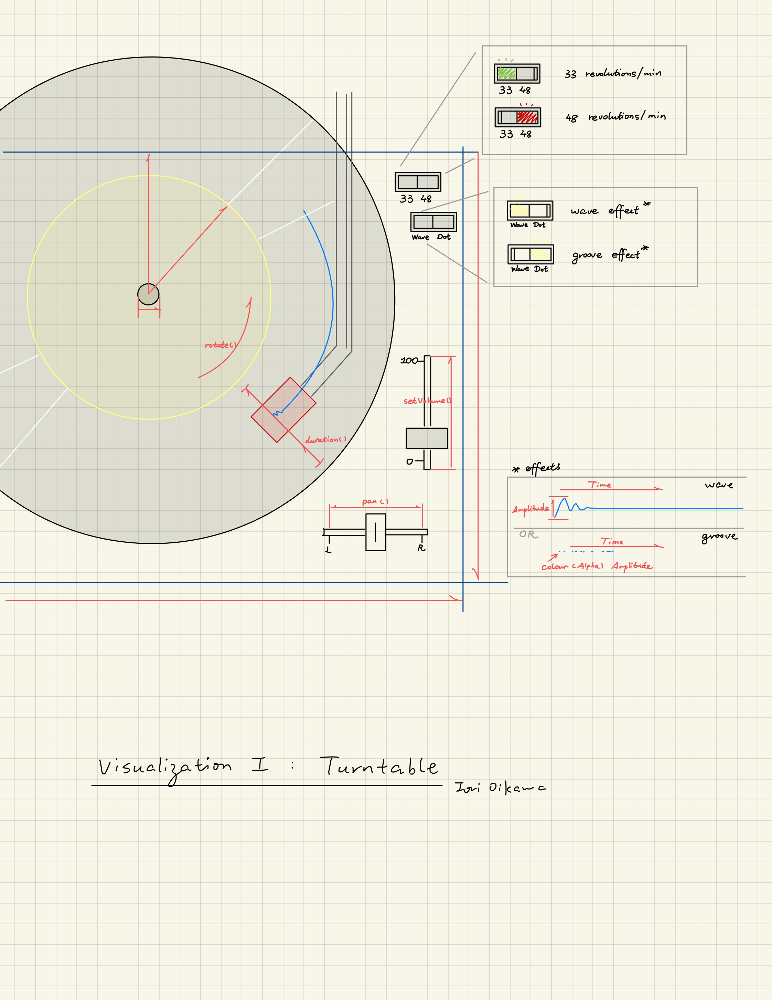
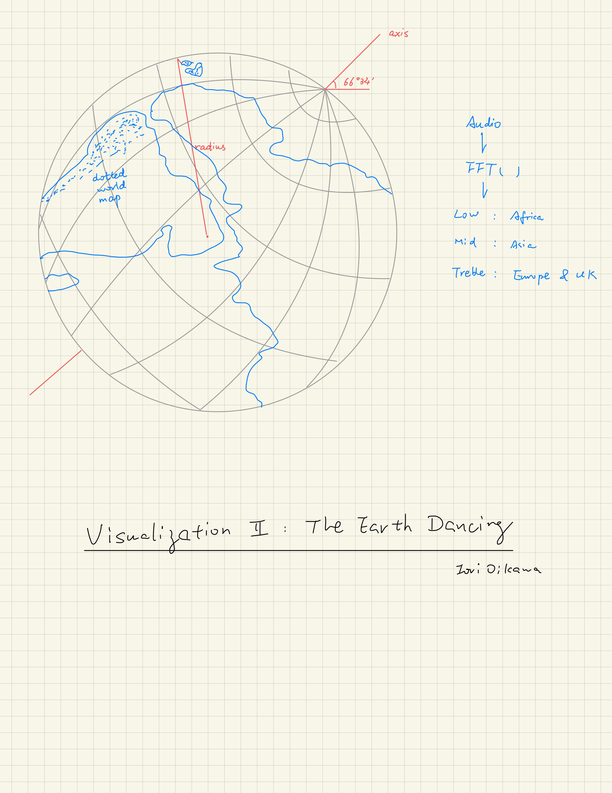
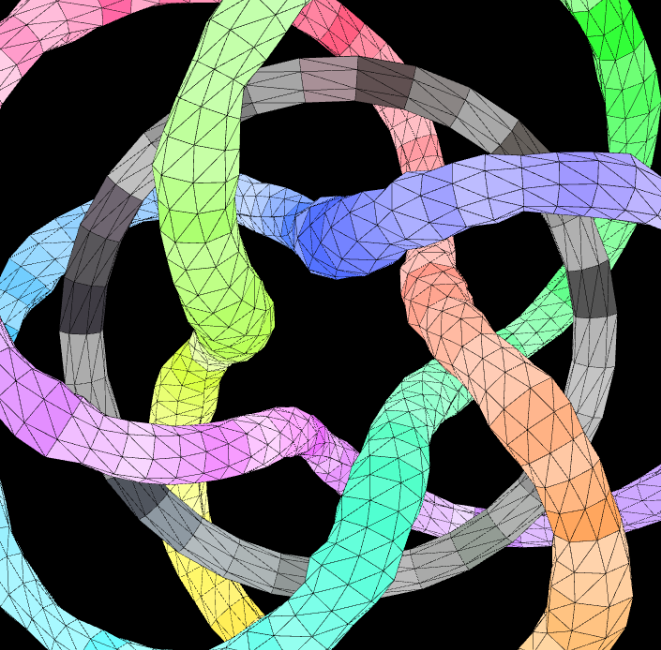

# SoundCanvas

Welcome to the **SoundCanvas**! This app takes audio inputs and generates dynamic, interactive visualizations. Below, we’ll showcase the design drafts and the final implementation. Visit the live demo [here](https://example.com/).

***Press keyboard 1-6 to switch among different visualizations!***

---

## 🎨 Design Drafts

### Visualization I: Turntable
This concept revolves around a rotating turntable design that reflects the rhythm, amplitude, and other audio effects:

**Key Elements:**
- Rotating vinyl representing playback speed (33/48 RPM).
- Wave and groove effects visualizing audio amplitude and dynamics.
- Controls for panning and volume adjustments.

### Visualization II: The Earth Dancing
A global visualization where the Earth rotates and reflects the frequency ranges:

**Key Elements:**
- Dotted world map overlaid on a sphere.
- Frequency mapping:
  - Low frequencies (bass): Africa.
  - Mid frequencies: Asia.
  - Treble (high frequencies): Europe & UK.

### Bonus: Torus Knot

---

## 🚀 Final Implementation

Explore the app’s **interactive visualizations** and see how the initial designs evolved into the final product. The website includes:
- Real-time audio-reactive animations.
- Customizable effects based on user inputs (press key 1-6 on keyboard).
- Seamless integration of global and local visual elements.

Visit the live demo: [SoundCanvas](https://example.com/).

---

## 💡 How It Works

Everything is proudly based on `p5.sound.js`!

1. **Audio Input:** The app takes in real-time or pre-recorded audio.
2. **Processing:** Using Fast Fourier Transform (FFT), it extracts audio features (bass, mids, treble).
3. **Afterimage Effect:** Uses three suites (slow, medium, fast) of 6-order IIR bandpass filters designed in MATLAB to create an "afterimage" feeling of every indicators, enhancing the immersive visual experience.
4. **Visualization:** Maps audio features to animations:
    1. Frequency-domain spectrums
    2. Time-domain wave patterns
    3. Bass, lowMid, highMid, treble indicator needles
    4. Dancing earth: WebGL + 3D rendering
    5. Groove: storing preprocessed points on a json
    6. Torus knot: parametric mathematical modeling + WebGL

---

Enjoy visualizing your music!
